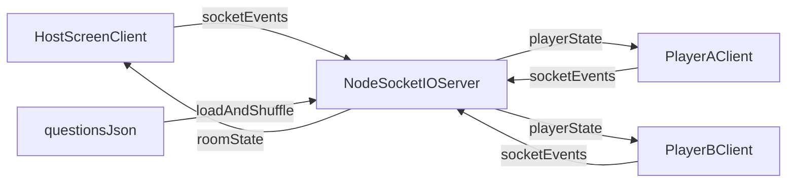

# AATE — Technical Plan (MVP)

## 1. Цель MVP
Реализовать браузерную 1v1-игру на 3 устройства:
- 1 `Host Screen` (создание комнаты + отображение матча),
- 2 `Player Phone` (подключение, ввод ника, ответы).

Критически важно: устойчивый real-time мультиплеер с простой логикой раунда.

## 2. Технологический стек

### Frontend
- `TypeScript`
- Легкий UI-слой для форм/кнопок (чистый TS + DOM, либо минимальная обертка)
- `socket.io-client`

### Backend
- `Node.js` + `TypeScript`
- `Socket.IO` (WebSocket + fallback)
- `Express` для healthcheck и раздачи статических файлов (опционально)

### Деплой
- VPS (Linux)
- `Nginx` как reverse proxy
- `systemd` или `pm2` для процесса приложения
- HTTPS через Let's Encrypt

## 3. Архитектура и роли подключений

Одна игровая комната = один матч:
- `host` — только просмотр состояния и управление стартом.
- `playerA` и `playerB` — игровые действия.

Сервер хранит состояние комнаты в памяти (`in-memory`) до конца матча.



## 4. Модель состояния комнаты
Рекомендуемая структура `RoomState`:
- `roomCode: string`
- `hostSocketId: string | null`
- `players: { playerA, playerB }`
  - `socketId`
  - `nickname`
  - `score`
- `deckSize: 10 | 20 | 40`
- `questions: Question[]` (выбранные для матча, уже перемешанные)
- `currentRoundIndex: number`
- `phase: "lobby" | "question" | "answering" | "guessing" | "reveal" | "finished"`
- `activePlayer: "playerA" | "playerB"`
- `selections`
  - `activeAnswer: 1 | 2 | 3 | null`
  - `guessAnswer: 1 | 2 | 3 | null`
- `phaseDeadlineTs: number | null`

## 5. Socket-события (MVP)

### Client -> Server
- `host:create_room`
  - payload: `{ deckSize }`
- `player:join_room`
  - payload: `{ roomCode, nickname }`
- `host:start_match`
  - payload: `{ roomCode }`
- `player:submit_active_answer`
  - payload: `{ roomCode, value: 1|2|3 }`
- `player:submit_guess_answer`
  - payload: `{ roomCode, value: 1|2|3 }`
- `client:reconnect_room`
  - payload: `{ roomCode, roleHint, nickname }`

### Server -> Client
- `room:created`
- `room:updated`
- `match:started`
- `round:phase_changed`
- `round:revealed`
- `score:updated`
- `match:finished`
- `error:domain`

Принцип: после любого значимого действия сервер отправляет актуальный `room snapshot`, чтобы UI не расходился по состояниям.

## 6. Фазы раунда и серверная логика
Сервер авторитетен для:
- смены фаз,
- таймера,
- проверки допустимости действий игрока в текущей фазе,
- начисления очков.

Порядок:
1. `question`: публикация вопроса.
2. `answering`: активный игрок отправляет реальный выбор.
3. `guessing`: угадывающий отправляет прогноз.
4. `reveal`: сервер сравнивает ответы, обновляет счет.
5. Поворот ролей и переход к следующему раунду или `finished`.

## 7. Хранение вопросов в JSON
Файл: `questions/relations.ru.json`

Рекомендуемая схема:
```json
{
  "id": "q_001",
  "text": "Как бы ты предпочел(а) провести идеальный вечер?",
  "options": [
    "Тихо дома вдвоем",
    "Активно и вне дома",
    "Спонтанно, без планов"
  ],
  "tags": ["relations", "lifestyle"]
}
```

Правила:
- минимум 40+ вопросов для режима `40`;
- уникальный `id`;
- ровно 3 варианта;
- без повторов в рамках одного матча;
- валидация JSON при запуске сервера.

## 8. Маршруты и экраны

### Host
- `/host` — создание комнаты (выбор 10/20/40, показ кода/QR).
- `/host/room/:roomCode` — экран матча: вопрос, фаза, счет, победитель.

### Mobile
- `/play` — ввод ника + кода комнаты.
- `/play/room/:roomCode` — матч: таймер, роль, варианты 1/2/3, статус отправки.

## 9. Локальное хранение на телефоне
- В `localStorage` хранится только `lastNickname`.
- Любое игровое состояние живет только на сервере в комнате.

## 10. Надежность и edge cases
- Если игрок отключился:
  - матч ставится на паузу на ограниченное время (например 30 секунд), либо авто-выход по таймауту.
- Если переподключился:
  - сервер восстанавливает роль через `reconnect` событие и отдает snapshot.
- Защита от двойных отправок:
  - сервер принимает только первое валидное действие в фазе.

## 11. Безопасность и базовая защита
- Серверная валидация всех входных payload.
- Ограничение длины ника и фильтрация пробельных/пустых значений.
- Простая rate-limit защита на чувствительные события (`join`, `submit`).

## 12. План деплоя на VPS
1. Подготовить сервер: Node LTS, Nginx, certbot.
2. Собрать приложение (`frontend build` + `backend build`).
3. Запустить backend как сервис (`systemd` или `pm2`).
4. Настроить Nginx:
   - HTTPS;
   - проксирование `/socket.io/` с upgrade headers;
   - раздача фронтенда.
5. Подключить домен и обновить DNS A-запись.
6. Проверить работу 3 клиентов в реальном интернете.

## 13. MVP QA-чеклист
- Создание комнаты и вход 2 игроков.
- Старт матча на 10/20/40 вопросов.
- Корректная смена ролей каждый раунд.
- Очки начисляются только за совпадение прогноза.
- Завершение матча и показ победителя/ничьей.
- Переподключение одного игрока без поломки комнаты.
- Мобильные браузеры (Android + iOS) и desktop браузеры.
